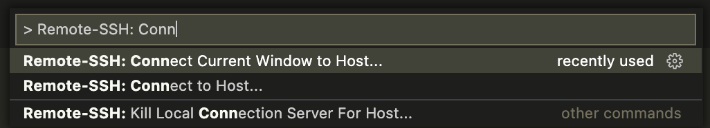

# Visual Studio Code Remote SSH Workflow Example

> This Documet is a Draft and as yet incomplete.

My brief example of how I use VS Code and the Remote SSH extension for my development workflow.

## Why This Workflow?

A lot of the Python code I write will ultimate run in a Linux environment. However, I don't typically run Linux as my primary environment. For work, I *have* to use Windows and at home I usually use MacOS (which is much closer to Linux than Windows, but is still not the same).

To give myself a consistent Linux environment when developing, I will spin up a Linux VM locally. For server use, I typically use Ubuntu, so a Ubuntu-based VM makes sense for me. For a lot of projects it doesn't really matter. This workflow doesn't rely on any particular Linux OS, so choose what you want.

## Remote SSH Extension

Microsoft's Remote SSH extension lets you access a folder on a remote system - via SSH, of course - as if it was local. That means you can use VS Code on your base system and use any/all the extensions you need.

This works by installing a small server application on the remote system which the local VS Code install communicates with over SSH. The server only runs under the SSH user used to install/access it, so `root` and/or `sudo` access isn't required.

The server installation is completely automatic and done the first time you connect to a remote host.

This extension is part of the Remote Development Extension.

## Setup SSH

I don't want to spend a long time explaining how to setup SSH on your Linux VM, there's already a thousand guides for that online. The installation instructions for the extension covers a lot of these details, so I would start [there](https://code.visualstudio.com/docs/remote/ssh).

However, the quick and dirty if you're using MacOS or Linux (OK I know, if you're already *on* Linux it doesn't make a lot of sense to need to connect to a Linux dev box, but you may want to keep your own machine clean!)

### Create SSH Key Pair

To create an SSH key pair:

```bash
ssh-keygen -t ecdsa -b 521 -C devbox-ssh
```

The `521` is not a typo!

When running the `ssh-keygen` command, it will prompt you with some questions, including where to save the generated key pair. `/home/<usernmae>/.ssh` is the standard location on Linux. Pick wherever you want on Windows, I usually use `C:\Users\<username>\.ssh`.

> Modern Windows *should* have the equivalent `ssh-keygen.exe` command. If not, you can always use PuTTY-Gen. It uses it's own dumb format, so I don't really recommend it.
>
> You can use any key type you want, with `rsa` usually being the default. However, newer versions of OpenSSH is moving away from `rsa` as the default (and there was a known bug with `rsa` keys in Windows' version of OpenSSH, which may or may not have been addressed by now.)

### Transfer Private Key to Remote Host

Once you have your key pair, you need to send your public key to the dev box:

```bash
ssh-copy-id -i /home/etzeitet/.ssh/devbox_ecdsa etzeitet@10.10.10.10
```

This will prompt you for your SSH password to your dev box. Once complete, the public key will be added to your dev box. You should now be able to SSH to it using the key:

```bash
ssh etzeitet@10.10.10.10
```

You may need to specify the exact private key using `-i` depending on where you saved it.

### SSH Config

In your `.ssh` directory, you can create a file called `config` and create a `Host` object. This can save you some tedious typing when wanting to SSH. VS Code also uses the file to connect to a host.

This is an example `config` for the dev box:

```ssh
Host devbox
    HostName 10.10.10.10
    User etzeitet
    IdentityFile ~/.ssh/devbox_ecdsa
    IdentitiesOnly yes
```

Using the above, you can do just `ssh devbox` and SSH will use the `config` to do the rest.

## Connect VS Code

Open a new VS Code window.

Press F1 to open the Command Pallette and search for `Remote-SSH`.

Choose `Connect Current Window to Host...`



VS Code should then show you a list of hosts taken from your SSH config file, select your devbox.

[image]

If required, enter your SSH password or key's passphrase.

[image]

VS Code will now connect to your dev box.

> Note: If this is the first time connecting using Remote SSH, it may take a few minutes for the VS Code server to be installed on the remote host. You typically only need to do this once (or whenever there is a significant update to VS Code).
>
> Connections are normally instant once the code is installed.

Once successfully connected, you can go to the Extensions tab in VS Code, and opt to install any required extensions to the remote host.

[image]

In the very least you will want Python!

Now that you have access to the remote host, you can open a project directory and start working as if locally. You can also open a terminal directly on the remote host.

> I *usually* have a VS Code session open on my dev box at work, so it's really handy to have quick access to a Linux terminal from my Windows box, without needing to pop open a separate terminal window.

That's it. If you just want remote development on a Linux host, you are all done.

## Remote Docker

Let's face it. Docker Desktop is rubbish. It doesn't work. It was a bad idea that just got a bit out of hand.

OK, so that's not strictly true, but I am not a fan and much prefer to run Docker natively in Linux, even if in a VM locally. This is all DD actually does in the background, but with layers of "helpful" tooling on top. We don't need any of that!
